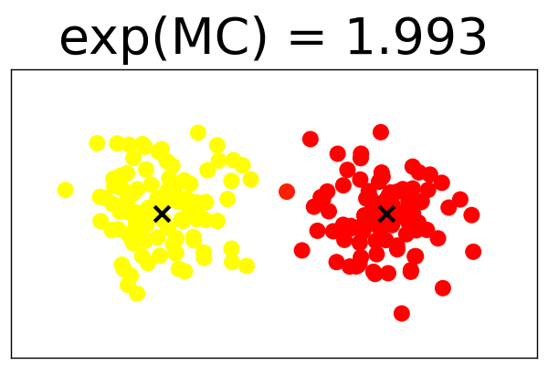

# MixtureComplexity

## About

Mixture complexity is an index to continuously measure the cluster size
given a finite mixture model.
It is related to the logarithm of the cluster size.
Some examples of exp(MC) are illustrated below.




We apply MC to the issue of gradual change detection problems.
By tracking MC,
we can find the changes in the clustering structure.

Further, MC can be decomposed according to the mixture hierarchy;
it enables us to analyze the detail of substructures.

## Usage

Currently, algorithms are implemented for a Gaussian mixture model (GMM).
For details, see `.ipynb` files.

### Calculate MC
```
from src import mc

X = ...  # data (shape = (N, D))
gmm_parameters = {
    'pi': ...           # propositions of the mixture components.
    'means': ...        # means of GMM.
    'covariances': ...  # covariances of GMM.
}
mixture_complexity = mc(X=X, **gmm_parameters)
```

### Calculate the decomposition of MC
```
from src import mc_decomp

X = ...  # data (shape = (N, D))
gmm_parameters = {
    'pi': ...           # propositions of the mixture components.
    'means': ...        # means of GMM.
    'covariances': ...  # covariances of GMM.
}
partition = ...  # partition matrix

mixture_complexity = mc_decomp(X=X, **gmm_parameters, partition=partition)
```

### Calculate MC for the dataset (sequence of the data).
```
from src import TrackMC

XX = ...  # dataset (shape = (T, N, D))

track_mc = TrackMC()
track_mc.fit(XX)
K = track_mc.K_list        # sequence of the cluster size.
mc = track_mc.mc_list(XX)  # sequence of the MC.
```

### Calculate the decomposition of MC for the dataset.
```
from src import TrackMCDecomp

XX = ...  # dataset (shape = (T, N, D))

track_mc_decomp = TrackMCDecomp()
track_mc_decomp.fit(XX)
track_mc_decomp.mc_total_        # (np.ndarray, shape=(T,)): MC (total).
track_mc_decomp.mc_interaction_  # (np.ndarray, shape=(T,)): MC (interaction).
track_mc_decomp.W_               # (np.ndarray, shape=(T, L)): W (cluster l).
track_mc_decomp.mc_local_        # (np.ndarray, shape=(T, L)): MC (cluster l).
```

## Jupyter
Execution examples for toy data, artificial datasets, and House dataset
provided by the UCI Machine Learning Repository (Dheeru and Casey, 2017)
are illustrated in `.ipynb` files.

### References
* Dua Dheeru nd Graff Casey. UCI Machine learning repository, 2017.
[URL](http://archive.ics.uci.edu/ml)